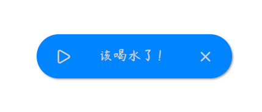

# ✦ 极简悬浮胶囊倒计时 ✦

我在小红书发布了许多 Obsidian 的教程和插件开发进度，你的关注就是对我最大的支持

高颜值悬浮胶囊倒计时，喝水提醒、番茄钟、防疲劳，一拖即用。

  

[简体中文](#简体中文) | [用法](#用法) | [English](#english) | [Usage](#usage)

---

## 简体中文

**Capsule Timer（极简悬浮胶囊倒计时）** 是一款为 Obsidian 用户量身定制的高颜值、无干扰悬浮倒计时插件。极简美学设计，高精准度计时，帮助您在专注写作或工作时轻松掌控节奏。

### 核心功能

#### 1. 极简毛玻璃胶囊悬浮窗
半透明毛玻璃质感，自适应深色/浅色主题。深色模式呈"奶咖胶囊"，浅色模式呈"暗灰胶囊"。按钮悬停变色、点击微弹，融入极简桌面美学。

#### 2. 智能休眠校准（防漂移）
锁定真实目标截止时间戳，无惧系统休眠。合上笔记本重新唤醒后自动校验真实时间差，超时立刻提醒，彻底解决休眠后计时卡死问题。

#### 3. 位置记忆与边缘防丢失
拖拽到任意位置，松手即自动记忆坐标。严格的坐标约束算法确保悬浮窗永远不会被拖出屏幕外，窗口大小变化后自动调整。

#### 4. 双计时模式自由切换
- **真实时间模式**：适合喝水提醒、番茄钟，关闭软件时间继续走
- **仅软件运行模式**：适合防用眼疲劳，关闭或休眠时时间暂停

#### 5. 纯净设计零残留
完全离线运行，生命周期主动释放，定时器手动销毁，不占用额外内存。

***

## 用法

1. 前往 **设置** > **Capsule Timer**，设置倒计时时长和到期提示语。
2. 点击左侧 **钟表** 图标启动倒计时，底部状态栏实时显示进度。
3. 时间归零后，胶囊悬浮窗弹出：
   - 点击 **播放** 按钮快速重启一轮
   - 点击 **X** 按钮关闭提醒
4. 拖拽悬浮窗文字区域可调整位置，松手即保存。

***

### 设置项一览

| 设置项 | 说明 |
|--------|------|
| 倒计时时间 | 设置时长（分钟） |
| 提示内容 | 倒计时结束时显示的文字 |
| 开启软件时自动启动 | 打开 Obsidian 自动开始倒计时 |
| 倒计时模式 | 真实时间 / 仅软件运行 |
| 显示状态栏倒计时 | 底部状态栏实时显示剩余时间 |
| 深色/浅色模式背景色 | 自定义胶囊悬浮窗背景色 |

***

### 赞赏支持

🎁 如果觉得有用，请作者喝杯咖啡

 

  

***

### 安装方法

#### 方法一：社区插件安装（推荐）

待插件通过审核并上架社区市场后：
1. 打开 Obsidian **设置** > **社区插件** > **浏览**。
2. 搜索并选择 `Capsule Timer`。
3. 点击 **安装** 并选择 **启用**。

#### 方法二：手动安装

1. 前往 [Releases](https://github.com/hornatx/capsule-timer/releases) 页面下载最新的 `main.js`、`manifest.json` 和 `styles.css` 文件。
2. 打开您的 Obsidian 库所在的本地文件夹。
3. 进入 `.obsidian/plugins/` 目录，并创建一个名为 `capsule-timer` 的文件夹。
4. 将下载的三个文件放入该文件夹中。
5. 在 Obsidian **设置** > **社区插件** 中重新加载并开启该插件。

***

QQ 交流群：1094620986

---

## English

**Capsule Timer** is a beautifully designed, distraction-free floating countdown timer plugin for Obsidian. Combining elegant minimalist aesthetics with solid, drift-free timing logic, it helps you manage hydration reminders, Pomodoro sessions, or eye-strain breaks effortlessly.

***

### Features

#### 1. Minimalist Frosted Glass Capsule UI
Translucent glassmorphism design with automatic theme adaptation — warm "Milky Coffee" in Dark Mode, sleek "Slate Gray" in Light Mode. Micro-interactions on hover and click blend into a polished desktop aesthetic.

#### 2. Smart Sleep-Proof Accuracy
Timestamp-based tracking ensures drift-free timing. If your computer sleeps or hibernates, the plugin recalculates elapsed time upon waking and triggers immediately if expired.

#### 3. Position Memory & Viewport Clamping
Drag the capsule anywhere on screen — coordinates are saved automatically. Robust boundary calculations prevent the capsule from being dragged off-screen and auto-adjust on window resize.

#### 4. Dual Counting Modes
- **Real Time Mode**: Perfect for hydration reminders or Pomodoro — time keeps ticking even when Obsidian is closed.
- **App-Only Mode**: Ideal for eye-strain prevention — time pauses when the app is closed or system sleeps.

#### 5. Clean, Leak-Free Engineering
Fully offline operation. Complete lifecycle teardown with active timer cleanup — no background CPU consumption, no memory leaks.

***

## Usage

1. Go to **Settings** > **Capsule Timer** to configure duration and alert message.
2. Click the **Clock** ribbon icon to start the countdown. A live countdown appears in the status bar.
3. When time runs out, the capsule appears:
   - Click **Play** to quickly restart a new session.
   - Click **X** to dismiss the alert.
4. Drag the capsule text area to reposition. Position saves automatically on release.

***

### Settings Overview

| Setting | Description |
|---------|-------------|
| Duration (minutes) | Countdown duration |
| Alert Message | Text shown when timer expires |
| Auto-start on launch | Start countdown automatically when Obsidian opens |
| Counting Mode | Real time / App-only |
| Show Status Bar | Display live countdown in the status bar |
| Dark/Light Mode Background | Customize capsule background color |

***

### Installation

#### Method 1: Community Plugins (Recommended)

Once reviewed and listed on the community marketplace:
1. Open Obsidian **Settings** > **Community plugins** > **Browse**.
2. Search for and select `Capsule Timer`.
3. Click **Install** and then **Enable**.

#### Method 2: Manual Installation

1. Go to the [Releases](https://github.com/hornatx/capsule-timer/releases) page to download the latest `main.js`, `manifest.json` and `styles.css` files.
2. Open your Obsidian vault folder on your computer.
3. Navigate to the `.obsidian/plugins/` directory and create a folder named `capsule-timer`.
4. Place the downloaded files into this folder.
5. Reload and enable the plugin in Obsidian **Settings** > **Community plugins**.

***

QQ Group: 1094620986